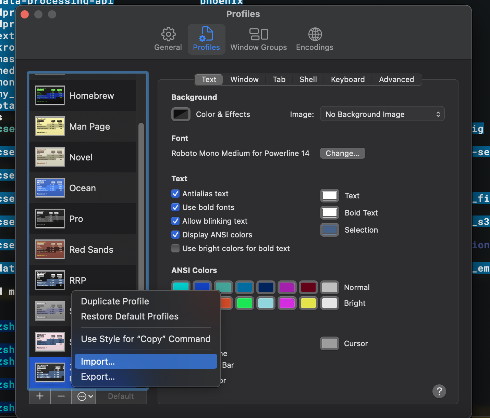

# My ZSH configuration

This is how the `${USER}` like the terminal setup on their machines!

https://github.com/rpai9/my_zsh_config/assets/68650968/79cfdb1e-d435-4eb8-956f-60d40a45dde0

## How to setup?
- Create a dir called `zsh_theme` at home folder and move the content of `zsh_theme` to `~/zsh_theme` on your computer.
- Copy the content of zshrc to ~/.zshrc
- For fonts package installation

  ```git clone https://github.com/powerline/fonts.git && cd fonts && ./install.sh```

  Then run

  ```cd .. && rm -rf fonts```

- Open terminal -> Go to settings -> Profiles -> click on three dots at the bottom and select import to import the ZSH.terminal file

<p align="center">
  
</p>
